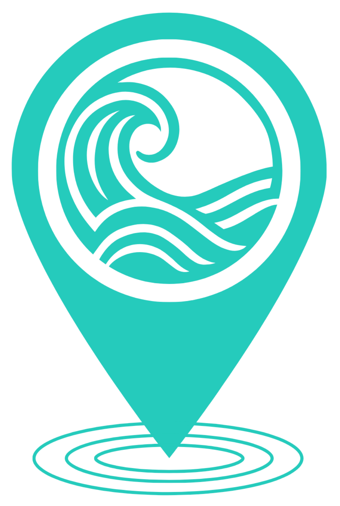
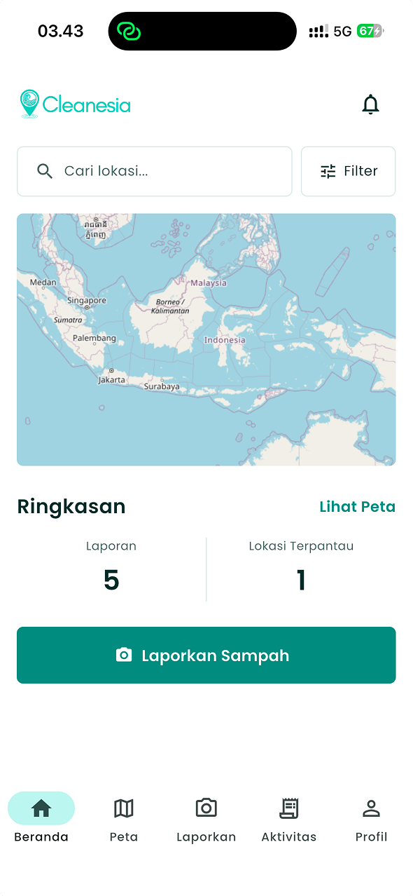
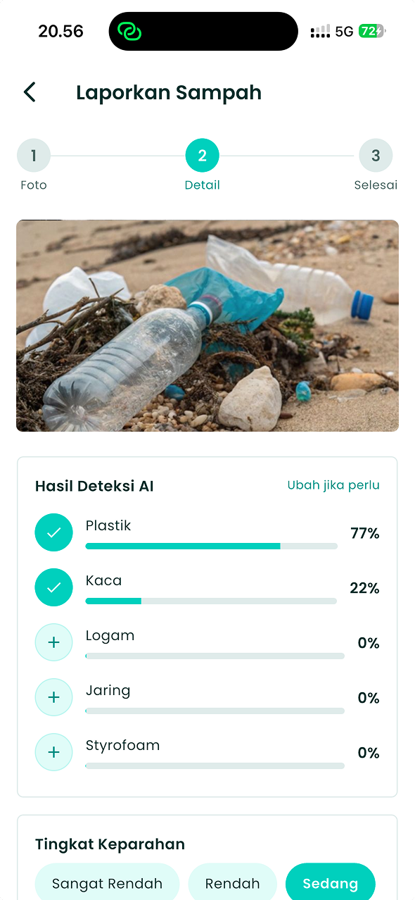
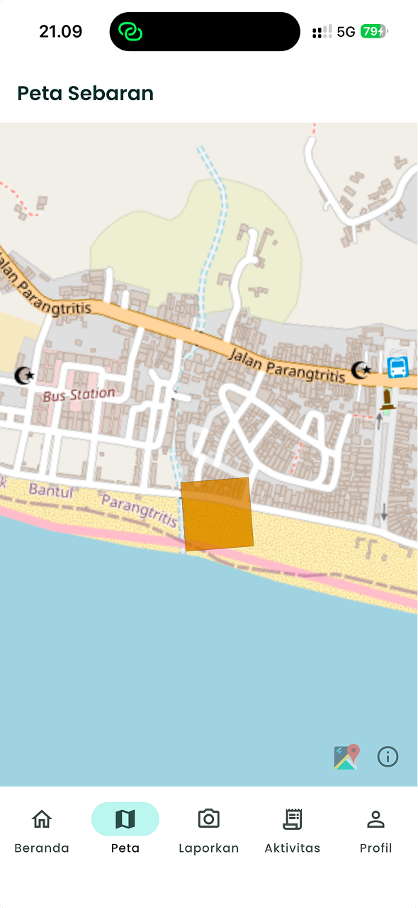

<p align="center">
  
</p>

<h1 align="center">Cleanesia</h1>

<p align="center">
  <b>Aplikasi Pemetaan Sebaran Sampah Laut Berbasis Kecerdasan Buatan dan Partisipasi Warga Pesisir</b>
</p>

<p align="center">
  
  
  
  
</p>

---

## Ringkasan

Cleanesia menjadikan warga pesisir sebagai jaringan pelapor terdistribusi untuk memetakan sebaran sampah laut di Indonesia. Warga cukup memotret sampah di pantai, model kecerdasan buatan yang berjalan langsung di ponsel mengenali jenis sampah pada foto tanpa memerlukan koneksi internet. Setiap laporan digabungkan menjadi peta kepadatan per area yang membantu komunitas kebersihan pantai dan pemerintah menentukan lokasi prioritas pembersihan.

Aplikasi ini dikembangkan untuk **GEMASTIK XIX 2026, Divisi Pengembangan Perangkat Lunak**.

> Cleanesia berkontribusi pada Tujuan Pembangunan Berkelanjutan (SDG) nomor 14, Ekosistem Lautan, dengan mengurangi hambatan ketersediaan data lapangan dalam pemantauan sampah laut.

---

## Tangkapan Layar


| Layar Beranda | laporan (Deteksi AI) | Peta Sebaran |
|:---:|:---:|:---:|
|  |  |  |

---

## Fitur Utama

- **Klasifikasi jenis sampah di ponsel (offline mode).** Model TensorFlow Lite mengenali lima jenis sampah secara *multilabel* langsung di perangkat, tanpa mengirim foto ke mana pun dan tanpa koneksi internet.
- **Estimasi tingkat keparahan.** Pelapor menetapkan tingkat keparahan pada skala lima tingkat, dengan dukungan koreksi hasil deteksi AI (*human-in-the-loop*).
- **Peta sel keparahan.** Laporan digabung menjadi peta yang menandai keparahan terkini per area, dengan warna yang memudar seiring umur laporan dan penanda abu-abu untuk area yang belum terpantau.
- **Mode offline.** Laporan yang dibuat tanpa sinyal disimpan di antrean lokal dan tersinkron otomatis begitu perangkat kembali daring.
- **Riwayat & status sinkronisasi.** Pengguna dapat memantau laporannya sendiri beserta status "Terkirim" atau "Menunggu sinkron".
- **Lintas platform.** Satu basis kode berjalan di Android dan iOS.

---

## Cara Kerja

Arsitektur Cleanesia memisahkan dua lapisan kerja: klasifikasi yang berjalan di ponsel dan agregasi data yang berjalan di server.

<p align="center">
  
</p>

1. **Ponsel (offline mode):** foto diambil, model TFLite mengklasifikasi jenis sampah, pengguna mengoreksi dan menetapkan keparahan, lalu laporan masuk ke antrean lokal.
2. **Sinkronisasi:** saat daring, laporan terkirim otomatis ke Firebase.
3. **Server:** Cloud Firestore menyimpan laporan; Cloud Functions memperbarui data per sel dengan keparahan laporan terbaru; aplikasi membaca data sel yang ringan untuk menampilkan peta.

---

## Model Kecerdasan Buatan

Model dibangun dengan *transfer learning* dari **MobileNetV3-Small**, dilatih pada gabungan dataset publik **TACO** dan **TrashNet**, lalu dikonversi ke **TensorFlow Lite** dengan kuantisasi *float16*.

- **Kelas (multilabel):** Plastik, Styrofoam, Logam, Kaca, Jaring (*ghost gear*)
- **Keluaran:** lima nilai keyakinan *sigmoid* yang independen (tidak berjumlah 100%)
- **Ukuran model:** 1,91 MB

### Hasil Pengujian (data validasi)

| Kelas | Presisi | Recall | F1 |
|---|:---:|:---:|:---:|
| Plastik | 0,76 | 0,89 | 0,82 |
| Kaca | 0,89 | 0,85 | 0,87 |
| Logam | 0,73 | 0,78 | 0,75 |
| Styrofoam | 0,40 | 0,27 | 0,32 |
| Jaring | 0,18 | 0,50 | 0,27 |
| **Rata-rata makro** | | | **0,61** |

### Kecepatan (iPhone 15)

| Tahap | Waktu rata-rata |
|---|:---:|
| Inferensi model | ~68 ms |
| Total per foto (termasuk pra-pemrosesan) | ~249 ms |

> Kelas Styrofoam dan Jaring masih lemah karena keterbatasan contoh pada dataset publik. Pengayaan data lapangan direncanakan untuk pengembangan berikutnya. Mekanisme koreksi manual oleh pelapor berperan sebagai penyaring kualitas sekaligus sumber data pelatihan tambahan.

---

## Logika Peta Sel

- Koordinat tiap laporan dikuantisasi ke **sel grid** (~100 m).
- Warna sel = **keparahan laporan terbaru** pada sel itu (bukan rata-rata, bukan jumlah laporan).
- Kesegaran warna **memudar** seiring bertambahnya umur laporan.
- Sel yang melewati ambang basi ditandai **abu-abu (belum terpantau)**.

Pendekatan ini menghindari bias yang muncul apabila kepadatan dihitung dari banyaknya laporan warga pada suatu area.

---

## Teknologi

**Aplikasi (Frontend)**
- Flutter, Dart
- Riverpod (manajemen state)
- `tflite_flutter` + `image` (inferensi & pra-pemrosesan on-device)
- `flutter_map` + `latlong2` (peta, tile OpenStreetMap)
- `geolocator`, `image_picker`, `path_provider`

**Backend & Infrastruktur**
- Firebase: Cloud Firestore, Authentication (anonim), Cloud Functions
- Sinkronisasi luring melalui *offline persistence* Firestore

**Machine Learning**
- Python, TensorFlow / Keras
- MobileNetV3-Small (transfer learning) → TensorFlow Lite (float16)
- Dataset: TACO, TrashNet

---

## Memulai

### Prasyarat

- Flutter SDK (Android + iOS)
- Android Studio / Xcode (sesuai target)
- Akun Firebase
- Node.js (untuk Cloud Functions)

### Menjalankan secara lokal

```bash
# 1. Klon repositori
git clone https://github.com/dimaswirabakti/cleanesia.git
cd cleanesia

# 2. Pasang dependency
flutter pub get

# 3. Konfigurasikan Firebase (menghasilkan firebase_options.dart & berkas konfigurasi platform)
dart pub global activate flutterfire_cli
flutterfire configure

# 4. (iOS) pasang pod
cd ios && pod install && cd ..

# 5. Jalankan
flutter run
```

Aktifkan **Cloud Firestore** dan **Authentication (Anonymous)** di Firebase Console. Untuk agregasi peta, deploy Cloud Functions:

```bash
cd functions
npm install
firebase deploy --only functions
```

> Catatan: model klasifikasi (`assets/model/model_jenis.tflite`) sudah tertanam di aplikasi, sehingga klasifikasi berjalan tanpa konfigurasi tambahan.

### Membangun APK Rilis

```bash
flutter build apk --release --split-per-abi
```

APK untuk perangkat Android 64-bit modern tersedia di:

```
build/app/outputs/flutter-apk/app-arm64-v8a-release.apk
```

Untuk memasang APK, aktifkan izin *Install from Unknown Sources* pada perangkat Android.

---

## Tim

**Mencari Jati Diri** | Universitas Gadjah Mada

- Nyoman Dimas W. B.
- Khayr Nouredine Yunus
- Rafa Irhamniyansyah Achmad

---

## Lisensi

Proyek ini dilisensikan di bawah **MIT License**, lihat berkas [LICENSE](LICENSE) untuk selengkapnya.

Copyright (c) 2026 Nyoman Dimas Wira Bakti, Khayr Nouredine Yunus, dan Rafa Irhamniyansyah Achmad (Tim Mencari Jati Diri, Universitas Gadjah Mada).

---

## Ucapan Terima Kasih & Kredit Data

- **TACO**: Trash Annotations in Context ([tacodataset.org](http://tacodataset.org))
- **TrashNet**: Yang & Thung, Stanford ([github.com/garythung/trashnet](https://github.com/garythung/trashnet))
- **MobileNetV3**: Howard et al., ICCV 2019
- **OpenStreetMap**: kontributor peta ([openstreetmap.org](https://www.openstreetmap.org))
- Data pesisir Bantul dirujuk dari penelitian Mutaqin dkk. (Jurnal Ilmu Lingkungan, 2025)

<p align="center">
  <i>Dibuat untuk lingkungan laut Indonesia.</i>
</p>
